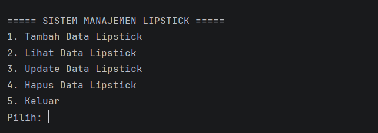
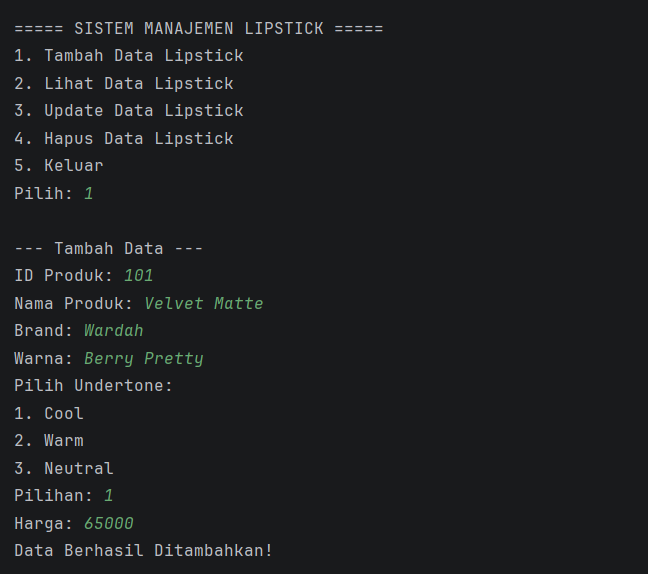
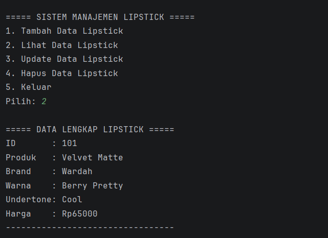
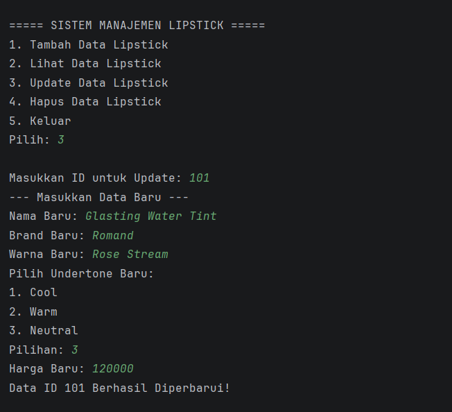
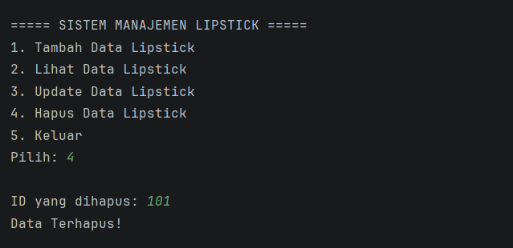
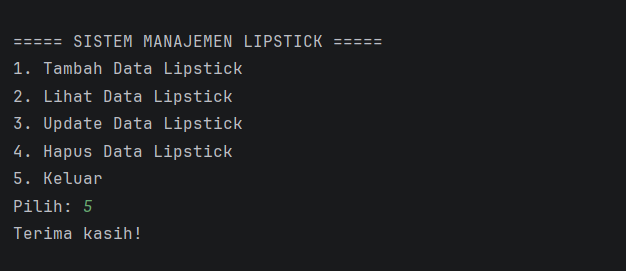

POSTTEST 1
Nama    : Andi Nurfadillah Hasan
NIM     : 2409106087
Kelas   : Informatika B2 '24

Judul Program
Sistem Manajemen Produk Lipstick Berdasarkan Undertone Kulit

Latar Belakang
Program ini merupakan aplikasi sederhana berbasis Java yang dibuat untuk mengelola data produk lipstick berdasarkan undertone kulit yang cocok.
Program dijalankan melalui terminal dengan sistem menu. Pengguna dapat memilih beberapa fitur seperti menambah data lipstick, melihat data yang sudah tersimpan, mengubah data, serta menghapus data.
Data lipstick disimpan menggunakan struktur data ArrayList sehingga data dapat ditambahkan dan dikelola selama program berjalan. Program ini juga dibuat dengan menerapkan konsep dasar Pemrograman Berorientasi Objek (OOP).

Penjelasan Program
Program menampilkan menu interaktif dengan pilihan:
- Tambah Data, Menambahkan produk baru ke daftar lipstick.
- Lihat Data, Menampilkan seluruh data yang tersimpan.
- Update Data, Memperbarui informasi produk berdasarkan ID.
- Hapus Data, Menghapus produk dari daftar berdasarkan ID.
- Keluar, Menghentikan program.
Setiap produk direpresentasikan oleh objek Lipstick, sedangkan kategori undertone kulit direpresentasikan oleh objek Undertone. Logika CRUD ditangani oleh class LipstickManager, yang menyimpan data dalam ArrayList.

Penjelasan Class yang Digunakan
Lipstick
Class ini merepresentasikan produk lipstick dengan atribut:
- id, ID produk
- namaProduk, Nama produk
- brand, Merek produk
- warna, Warna lipstick
- undertone, Undertone kulit yang cocok
- harga, Harga produk

Undertone
Class ini digunakan untuk mendefinisikan kategori undertone kulit (Cool, Warm, Neutral). Setiap objek memiliki:
- id, ID undertone
- namaUndertone, Nama undertone
- deskripsi, Penjelasan singkat mengenai undertone (Cool Cocok untuk kulit dengan rona biru/pink, Warm Cocok untuk kulit dengan rona kuning/emas dan Neutral Cocok untuk kulit seimbang antara cool dan warm)

LipstickManager
Class ini adalah pusat logika CRUD pada ArrayList<Lipstick>.
Metodenya meliputi:
- tambahLipstick(), Menambahkan data baru.
- tampilkanLipstick(), Menampilkan seluruh data yang tersimpan.
- updateLipstick(), Memperbarui data tertentu berdasarkan ID.
- hapusLipstick(), Menghapus data tertentu berdasarkan ID.

Main
Class ini berisi method main() untuk menjalankan program. Di sini menu utama ditampilkan, dan setiap pilihan pengguna akan memanggil method yang sesuai di LipstickManager.

Penjelasan Code
1. Implementasi `ArrayList`
   Penyimpanan data dilakukan melalui `java.util.ArrayList`. Pemilihan struktur data ini didasarkan pada fleksibilitasnya dalam menambah atau menghapus elemen secara real-time tanpa perlu menentukan ukuran tetap di awal program.
2. Constructor dan Keyword `this`
   Pada saat objek lipstick diciptakan, Parameterized Constructor digunakan untuk melakukan inisialisasi data. Penggunaan keyword `this` berperan penting untuk membedakan antara variabel lokal pada parameter dengan properti yang dimiliki oleh objek tersebut.
3. Manajemen Input dan Buffer
   Interaksi pengguna ditangani melalui class `Scanner`. Untuk mencegah terjadinya kegagalan input (input yang terlompati), perintah `input.nextLine()` digunakan sebagai pembersih sisa newline setelah pengambilan data numerik (`nextInt`).
4. Logika Pemrosesan Data
    - Update: Sistem melakukan pencarian berdasarkan ID unik. Jika data ditemukan, sistem akan menimpa nilai properti lama dengan nilai baru melalui akses variabel langsung.
    - Delete: Penghapusan elemen dilakukan dengan mencari indeks objek yang sesuai, kemudian melepaskan referensi objek tersebut dari dalam list menggunakan fungsi `.remove()`.

Fitur Program
1. Menu Utama
Tampilan awal saat program dijalankan:

2. Tambah Data (Create)
Input data baru (ID, Nama, Brand, Warna, Undertone, Harga):

3. Lihat Data (Read)
Menampilkan daftar lipstick yang sudah tersimpan:

4. Update Data (Update)
Mengubah detail produk berdasarkan ID:

5. Hapus Data (Delete)
Menghapus produk dari daftar:

6. Keluar (Exit)
Berhenti dari program:
