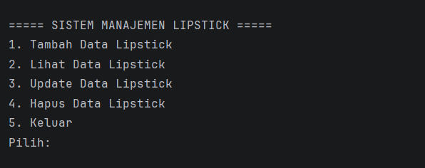
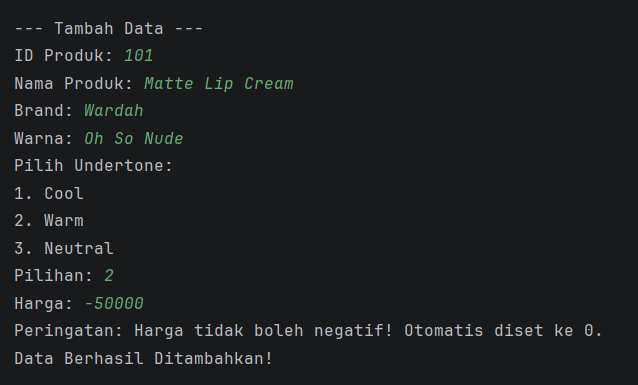
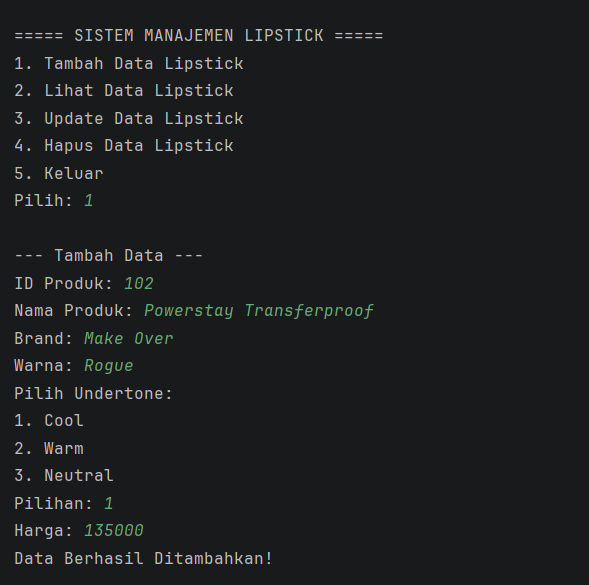
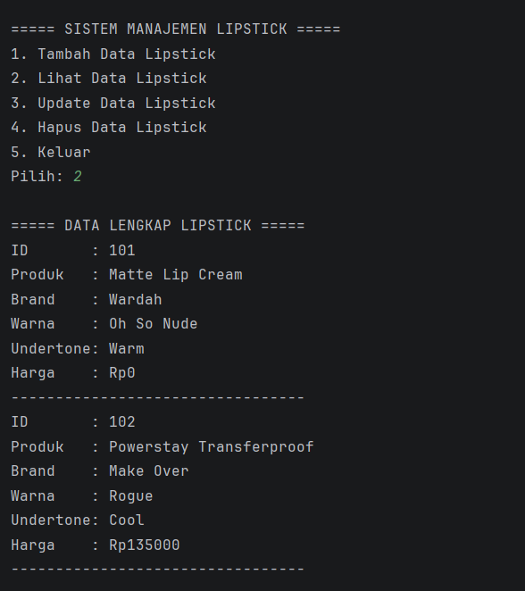
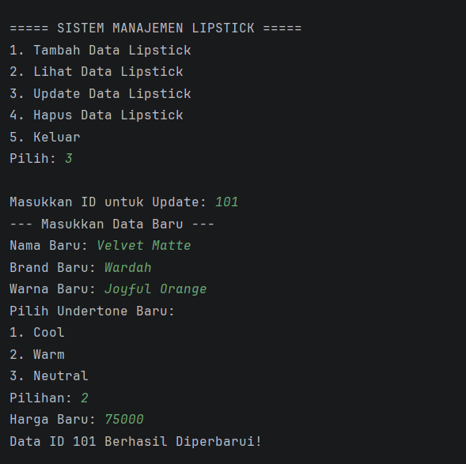
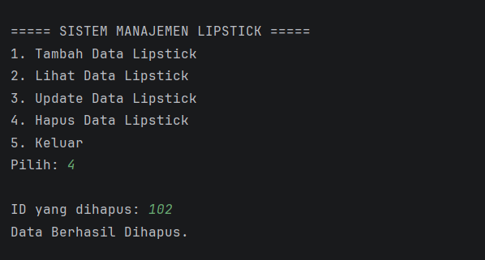
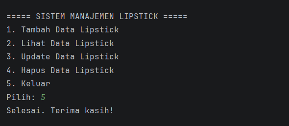

POSTTEST 2
Nama    : Andi Nurfadillah Hasan
NIM     : 2409106087
Kelas   : Informatika B2 '24

Judul Program
Sistem Manajemen Produk Lipstick Berdasarkan Undertone Kulit

Latar Belakang
Program ini merupakan aplikasi berbasis Java yang dibuat untuk mengelola data produk lipstick berdasarkan kategori undertone kulit yang sesuai.
Aplikasi dijalankan melalui terminal dengan sistem menu interaktif yang memungkinkan pengguna untuk melakukan operasi CRUD (Create, Read, Update, Delete).
Pada tahap pengembangan terbaru, sistem ini diperbarui untuk meningkatkan keamanan data dan kerapian arsitektur kode melalui penerapan konsep Encapsulation, penggunaan Access Modifiers, serta pengorganisasian file ke dalam Packages.
Hal ini memastikan integritas data tetap terjaga dari akses langsung yang tidak valid.

Struktur Proyek & Package
File kode program dikelompokkan ke dalam tiga package utama untuk menjaga modularitas sistem:
1. com.lipstick.main, Berisi class Main yang berfungsi sebagai titik masuk utama program.
2. com.lipstick.model, Berisi class-class yang merepresentasikan objek data seperti Item, Lipstick, dan Undertone.
3. com.lipstick.service, Berisi class LipstickManager yang menangani seluruh logika operasional dan manipulasi data.

Penjelasan Class yang Digunakan
Struktur program ini dirancang dengan memisahkan fungsi data dan logika ke dalam beberapa class yang saling berinteraksi:
1. Class Item
   Class ini berfungsi sebagai entitas dasar atau superclass. Atribut yang bersifat umum untuk semua item dalam sistem diletakkan di sini.

- id: Atribut unik untuk mengidentifikasi setiap entitas. Menggunakan access modifier protected agar dapat diakses langsung oleh subclass (Lipstick) namun tetap terlindungi dari akses luar package.

2. Class Lipstick 
   Class ini merupakan turunan dari class Item (Inheritance) yang merepresentasikan objek utama dalam sistem.

- Atribut Private: namaProduk, brand, dan harga. Data ini diisolasi sepenuhnya agar tidak bisa diubah secara ilegal dari luar class.
- Atribut Default: warna dan undertone. Hanya dapat diakses oleh class dalam satu package yang sama.
- Method Getter & Setter: Digunakan sebagai gerbang utama untuk berinteraksi dengan atribut private. Method setHarga() secara khusus dibekali logika validasi untuk memastikan integritas data.

3. Class Undertone
   Class pendukung yang berfungsi untuk mendefinisikan kategori rona kulit yang sesuai dengan produk lipstick.

- Atribut: id dan namaUndertone.
- Method Static defaultUndertones(): Menyediakan daftar pilihan tetap (Cool, Warm, Neutral) yang akan ditampilkan saat pengguna menambah atau memperbarui data produk.

4. Class LipstickManager
   Class ini bertindak sebagai pusat kendali (Logic Layer) yang menangani seluruh proses operasional data produk.

- ArrayList<Lipstick>: Digunakan sebagai media penyimpanan data dinamis yang menampung objek-objek dari class Lipstick.
- Method CRUD: - tambahLipstick(): Logika untuk instansiasi objek baru.
               - tampilkanLipstick(): Logika untuk membaca dan menampilkan data melalui getter.
               - updateLipstick(): Logika untuk mencari data berdasarkan ID dan memperbarui nilai atribut menggunakan setter.
               - hapusLipstick(): Logika untuk menghapus referensi objek dari daftar.

5. Class Main
   Class utama yang berfungsi sebagai entry point aplikasi.

- Berisi method main() yang mengelola interaksi antara pengguna dan sistem.
- Bertanggung jawab menampilkan menu navigasi dan meneruskan perintah pengguna ke method yang sesuai di dalam LipstickManager.

Penjelasan Code
Sistem ini mengintegrasikan logika pemrograman dasar dengan prinsip Encapsulation sebagai berikut:
1. Access Control (Private, Getter & Setter) Atribut sensitif seperti namaProduk, brand, dan harga kini bersifat private.
   Akses baca dilakukan melalui Getter, dan perubahan data dilakukan melalui Setter. Pada setHarga(), terdapat logika validasi untuk mencegah input nilai negatif.
2. Protected & Inheritance Modifier protected digunakan pada atribut id di dalam class Item agar class Lipstick dapat mengaksesnya secara langsung melalui mekanisme pewarisan tanpa membukanya secara publik.
3. Implementasi ArrayList Penyimpanan data menggunakan java.util.ArrayList karena fleksibilitasnya dalam menambah atau menghapus elemen secara dinamis tanpa perlu menentukan ukuran tetap di awal program.
4. Constructor dan Inisialisasi Saat objek Lipstick diciptakan, sistem memanggil constructor dari parent class (Item) untuk menginisialisasi atribut id.
   Hal ini memastikan proses pewarisan data antar class berjalan dengan benar sesuai struktur yang dibuat.
5. Manajemen Input dan Buffer Interaksi pengguna ditangani oleh class Scanner.
   Perintah input.nextLine() digunakan secara strategis untuk membersihkan sisa newline setelah pengambilan data numerik (nextInt) agar proses input berikutnya tidak terlompati.

Fitur Program
1. Menu Utama
   Tampilan awal saat program dijalankan.
   

2. Validasi Encapsulation
   Mekanisme proteksi saat sistem mendeteksi input data yang tidak valid.
   

3. Tambah Data (Create)
   Input data produk baru ke dalam sistem.
   

4. Lihat Data (Read)
   Menampilkan daftar lengkap produk yang tersimpan menggunakan akses getter.
   

5. Update Data (Update)
   Memperbarui informasi produk berdasarkan ID menggunakan akses setter.
   

6. Hapus Data (Delete)
   Menghapus produk dari daftar berdasarkan ID unik.
   

7. Keluar (Exit)
   Berhenti dari sesi program.
   