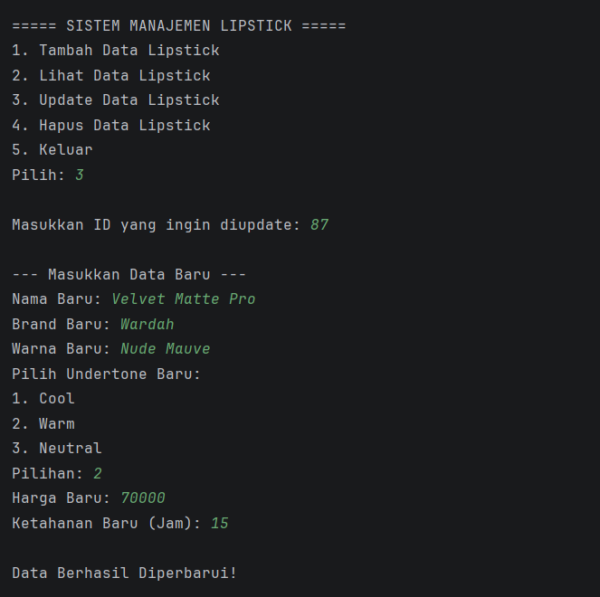

POSTTEST 4
Nama    : Andi Nurfadillah Hasan  
NIM     : 2409106087  
Kelas   : Informatika B2 '24

Judul Program
Sistem Manajemen Produk Lipstick Berdasarkan Undertone Kulit

Latar Belakang
Program ini merupakan aplikasi berbasis Java yang dirancang untuk mengelola data katalog produk lipstick secara terorganisir.
Sistem memungkinkan pengguna untuk memetakan produk berdasarkan kecocokan rona kulit (undertone).
Arsitektur program menerapkan prinsip Polymorphism secara menyeluruh, baik dalam bentuk Static Polymorphism (Overloading) maupun Dynamic Polymorphism (Overriding).
Hal ini bertujuan untuk meningkatkan fleksibilitas kode, mempermudah pemeliharaan, serta membuat program mampu menangani berbagai jenis objek produk dengan cara yang lebih general namun tetap akurat.

Struktur Proyek dan Package
Kode program dibagi ke dalam tiga package utama untuk menjaga modularitas dan memudahkan proses pemeliharaan kode:
1. com.lipstick.main, Berisi class `Main` sebagai titik masuk (entry point) aplikasi.
2. com.lipstick.model, Berisi model data utama seperti `Item`, `Lipstick`, `MatteLipstick`, `LipTint`, dan `Undertone`.
3. com.lipstick.service, Berisi class `LipstickManager` yang menangani seluruh logika operasional dan manipulasi data dalam ArrayList.

Penjelasan Class yang Digunakan
Struktur program menerapkan konsep Object-Oriented Programming (OOP) sebagai berikut:
1. Class Item (Superclass)
   Berfungsi sebagai entitas dasar yang memegang atribut umum (id).

2. Class Lipstick (Parent Class)
   Turunan dari class Item yang mendefinisikan atribut dasar lipstick. 
   Class ini menjadi basis penerapan Dynamic Polymorphism dengan menyediakan method tampilkanInfo() yang akan di-override oleh subclass.
   Selain itu, class ini menerapkan Static Polymorphism melalui overloading pada method updateData().

3. Subclass, MatteLipstick dan LipTint (Inheritance & Overriding)
   Kedua class ini mewarisi seluruh sifat dari class Lipstick. Keduanya mengimplementasikan Method Overriding:

- MatteLipstick: Meng-override method tampilkanInfo() untuk menambahkan detail unik berupa durasi ketahanan jam.
- LipTint: Meng-override method tampilkanInfo() untuk menambahkan detail unik berupa informasi bahan dasar.

4. Class LipstickManager (Logic Layer & Overloading)
   Bertindak sebagai pengelola data.
   Class ini menerapkan Static Polymorphism melalui method overloading pada fungsi cari() untuk meningkatkan efisiensi pencarian data melalui berbagai parameter.

Penjelasan Code
Beberapa poin teknis utama dalam pengembangan sistem ini antara lain:
1. Implementasi Dynamic Polymorphism (Method Overriding)
   Menggunakan anotasi @Override pada subclass untuk mendefinisikan ulang method tampilkanInfo() dari parent class.
   Hal ini memungkinkan sistem memanggil method yang sama namun menghasilkan output yang berbeda sesuai dengan tipe objek asli (runtime), sehingga kode tidak lagi memerlukan pengecekan manual yang rumit.

2. Implementasi Static Polymorphism (Method Overloading)
   Menerapkan konsep di mana satu class memiliki beberapa method dengan nama yang sama namun memiliki parameter yang berbeda (jumlah atau tipe datanya).
   
- Pada Model: Method updateData() di-overload agar dapat menerima satu parameter (Nama) atau dua parameter (Nama & Harga).
- Pada Manager: Method cari() di-overload agar sistem dapat mencari produk berdasarkan ID (int) maupun berdasarkan Nama (String).

3. Penghapusan Logika Instanceof
   Dengan adanya polimorfisme dinamis, penggunaan operator instanceof pada fitur "Lihat Data" kini dihilangkan. Sistem secara otomatis mengenali dan menjalankan implementasi method yang sesuai pada setiap objek dalam ArrayList<Lipstick>.

4. Upcasting dan Polimorfisme Koleksi
   Objek dari subclass (MatteLipstick/LipTint) disimpan ke dalam ArrayList<Lipstick> melalui teknik Upcasting. Saat perulangan terjadi, pemanggilan method polimorfik memastikan perilaku objek tetap spesifik.

5. Integritas Encapsulation
   Meskipun menerapkan polimorfisme, hak akses tetap dijaga ketat menggunakan modifier private dan protected. Interaksi data tetap wajib melalui gerbang getter dan setter.

Fitur dan Tampilan Program
1. Menu Utama
   Tampilan awal saat program dijalankan.
   

2. Tambah Data
   Input data produk baru ke dalam sistem.
   

3. Lihat Data
   Menampilkan daftar lengkap produk yang tersimpan.
   

4. Update Data
   Memperbarui informasi produk berdasarkan ID.
   

5. Hapus Data
   Menghapus produk dari daftar berdasarkan ID unik.
   

6. Keluar
   Mengakhiri sesi program dengan aman.
   