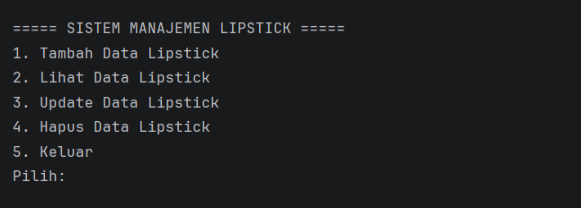
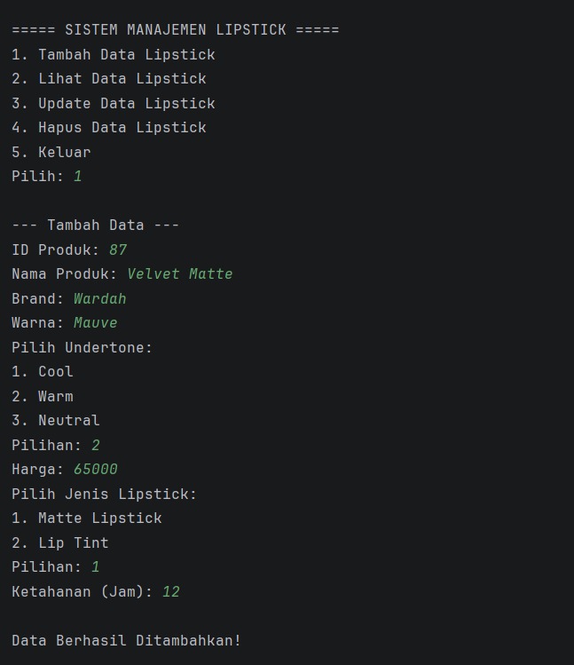
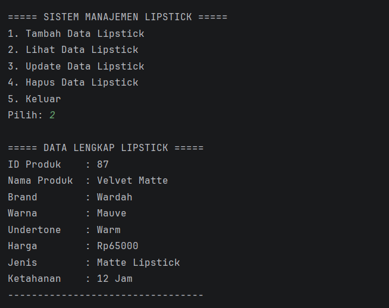
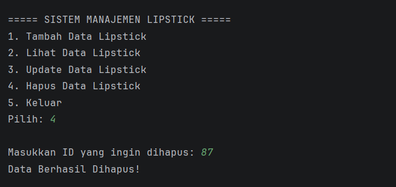
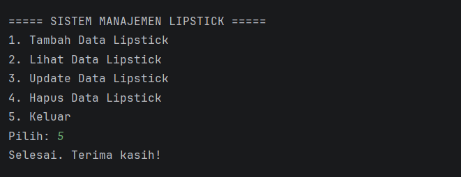

POSTTEST 5
Nama    : Andi Nurfadillah Hasan  
NIM     : 2409106087  
Kelas   : Informatika B2 '24

Judul Program
Sistem Manajemen Produk Lipstick Berdasarkan Undertone Kulit

Latar Belakang
Program ini merupakan aplikasi berbasis Java yang dirancang untuk mengelola data katalog produk lipstick secara terorganisir.
Sistem memungkinkan pengguna untuk memetakan produk berdasarkan kecocokan rona kulit (undertone).
Arsitektur program menerapkan prinsip Abstraction melalui penggunaan Abstract Class dan Interface.
Penerapan ini bertujuan untuk menyembunyikan detail implementasi yang kompleks dan hanya menampilkan fungsi esensial, sehingga struktur kode menjadi lebih terstandarisasi, aman, dan modular.

Struktur Proyek dan Package
Kode program dibagi ke dalam tiga package utama untuk menjaga modularitas dan memudahkan proses pemeliharaan kode:
1. com.lipstick.main, Berisi class `Main` sebagai titik masuk (entry point) aplikasi.
2. com.lipstick.model, Berisi model data utama seperti `Item`, `Lipstick`, `MatteLipstick`, `LipTint`, dan `Undertone`.
3. com.lipstick.service, Berisi class `LipstickManager` serta interface `ProdukOperasional` yang mengatur standar layanan operasional sistem.

Penjelasan Class yang Digunakan
Struktur program menerapkan konsep Object-Oriented Programming (OOP) sebagai berikut:
1. Class Item (Superclass)
   Berfungsi sebagai entitas dasar yang memegang atribut umum (id).

2. Class Lipstick (Abstract Class)
   Turunan dari class Item yang dideklarasikan dengan kata kunci abstract.
   Class ini berfungsi sebagai kerangka dasar yang tidak dapat diinstansiasi menjadi objek secara langsung.
   Di dalamnya terdapat Abstract Method tampilkanInfo() yang mewajibkan subclass untuk memberikan implementasi spesifik.

3. Subclass, MatteLipstick dan LipTint (Inheritance & Implementation)
   Kedua class ini mewarisi sifat dari Lipstick dan wajib mengimplementasikan seluruh abstract method yang tersedia.
   Keduanya merupakan bentuk nyata (concrete class) dari konsep Lipstick yang dikelola dalam sistem.

- MatteLipstick: Meng-override method tampilkanInfo() untuk menambahkan detail unik berupa durasi ketahanan jam.
- LipTint: Meng-override method tampilkanInfo() untuk menambahkan detail unik berupa informasi bahan dasar.

4. Interface ProdukOperasional
   Sebuah interface yang berfungsi sebagai kontrak fungsional.
   Interface ini mendefinisikan standar operasi yang harus dimiliki oleh sistem manajemen, seperti tambah, tampilkan, update, dan hapus data.

5. Class LipstickManager (Implementation Class)
   Class yang mengimplementasikan interface ProdukOperasional.
   Class ini bertanggung jawab menjalankan seluruh logika bisnis dan manipulasi data pada ArrayList.

Penjelasan Code
Beberapa poin teknis utama dalam pengembangan sistem ini antara lain:
1. Implementasi Abstract Class
   Menggunakan keyword abstract pada class Lipstick.
   Hal ini secara logis sangat tepat karena "Lipstick" merupakan sebuah konsep abstrak; produk yang nyata tersedia di pasar adalah tipe spesifik seperti Matte atau Lip Tint.

2. Implementasi Abstract Method
   Diterapkan pada method tampilkanInfo().
   Method ini tidak memiliki bodi (body method) pada class induk, sehingga memaksa subclass MatteLipstick dan LipTint untuk meng-override dan memberikan detail tampilan yang sesuai dengan karakteristik unik masing-masing produk.
   
- Pada Model: Method updateData() di-overload agar dapat menerima satu parameter (Nama) atau dua parameter (Nama & Harga).
- Pada Manager: Method cari() di-overload agar sistem dapat mencari produk berdasarkan ID (int) maupun berdasarkan Nama (String).

3. Penggunaan Interface (Contract Based)
   Interface ProdukOperasional digunakan untuk menetapkan standar perilaku (behavior) bagi class LipstickManager.
   Dengan menggunakan keyword implements, class manager wajib memenuhi seluruh kontrak metode yang telah didefinisikan dalam interface tersebut.

4. Abstraksi dan Polimorfisme
   Meskipun class Lipstick bersifat abstrak, program tetap dapat mendeklarasikan variabel bertipe Lipstick untuk menampung objek dari subclass-nya.
   Hal ini memungkinkan pemanggilan method abstrak secara polimorfik saat aplikasi berjalan (runtime).

5. Keamanan dan Integritas Data
   Dengan abstraksi, detail proses internal disembunyikan dari pengguna.
   Akses terhadap atribut tetap dikontrol melalui modifier protected untuk pewarisan dan private untuk enkapsulasi, dengan akses luar tetap melalui getter dan setter.

Fitur dan Tampilan Program
1. Menu Utama
   Tampilan awal saat program dijalankan.
   

2. Tambah Data
   Input data produk baru ke dalam sistem.
   

3. Lihat Data
   Menampilkan daftar lengkap produk yang tersimpan.
   

4. Update Data
   Memperbarui informasi produk berdasarkan ID.
   

5. Hapus Data
   Menghapus produk dari daftar berdasarkan ID unik.
   

6. Keluar
   Mengakhiri sesi program dengan aman.
   